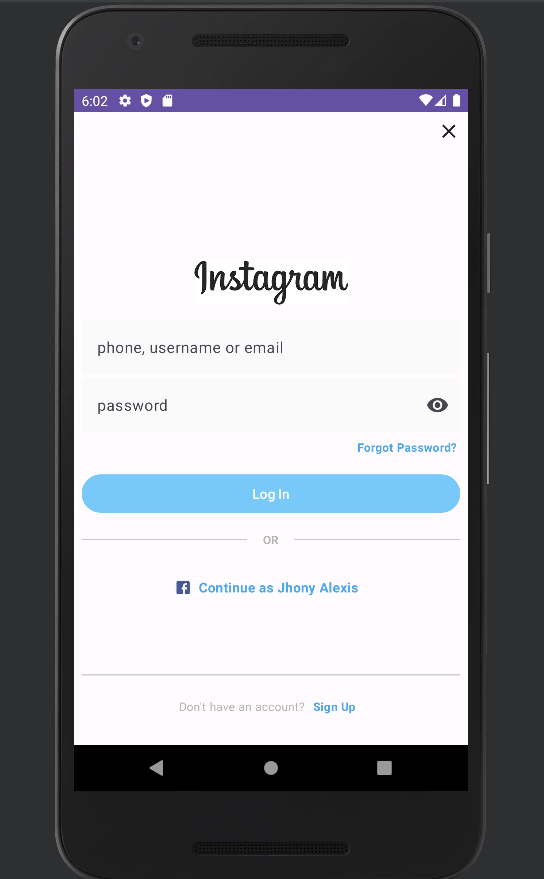

# InstagramLogin-JetpackCompose
Proyecto de implementación de inicio de sesión de la red social Instagram utilizando Jetpack Compose en Android.
Esta aplicación demuestra cómo crear una interfaz de usuario moderna y atractiva para el proceso de inicio de sesión en Instagram utilizando las capacidades de diseño y UI de Jetpack Compose
## Aplicación

